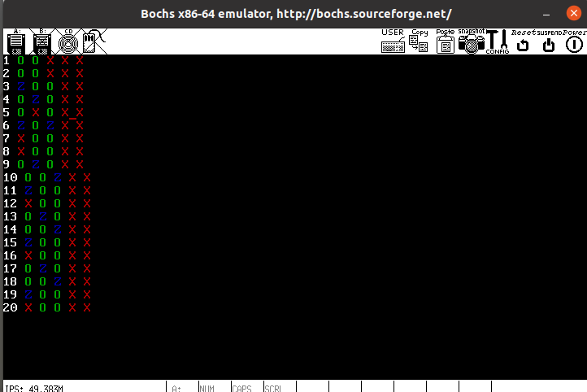
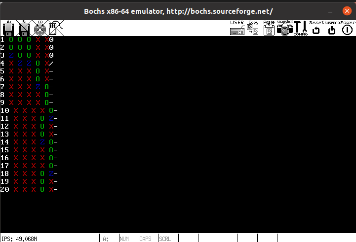
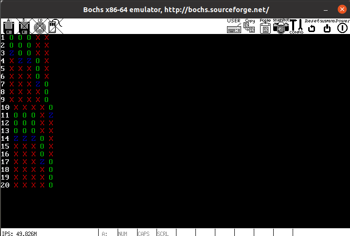

# 第四次作业说明文档

#### **201250031 吴禹廷**
<br>

## 1. 实验前准备

- 略改Makefile和bochsrc部分
  - Makefile部分在结尾处添加：
    ```Makefile
    run: image
    bochs
    ```
    使得其能自动运行
  - bochsrc部分将键盘映射路径改为<br>
    <code>keyboard: keymap=/usr/share/bochs/keymaps/x11-pc-us.map</code>
    </br>

## 2. 实现系统调用

### 2.1 添加打印字符串函数的系统调用

  - 在<code>const.h</code>中修改系统调用函数数量，将<code>NR_SYS_CALL</code>的值+1，此时<code>NR_SYS_CALL</code>的值为2。

  - 在<code>proto.h</code>中声明新添加的系统调用函数，添加如下声明：
    ```c
    PUBLIC void     sys_disp_str(char *);<br>
    PUBLIC void     disp_str_interface(char *);
    ```
    其中<code>sys_disp_str</code>函数为系统调函数名，<code>disp_str_interface</code>是其外部接口函数名。
  - 在<code>global.c</code>中的<code>system_call</code>数组中加入刚刚定义的系统调用，此时该数组定义如下：<br>
    ```c
    PUBLIC system_call sys_call_table[NR_SYS_CALL] =
    {sys_get_ticks, sys_disp_str};
    ```
  - 函数声明完成后，在<code>syscall.asm</code>中实现<code>sys_disp_str</code>和<code>disp_str_interface</code>：
    - <code>sys_disp_str:</code>
        ```asm
        extern  disp_str
        global	sys_disp_str
        sys_disp_str:
            pusha
            push ebx
            call disp_str
            popa
            pop ebx
            ret
        ```
    - <code>disp_str_interface:</code>
        ```asm
        _NR_disp_str_interface  equ 1
        global	disp_str_interface
        disp_str_interface:
            mov eax, _NR_disp_str_interface
            push ebx
            mov ebx, [esp + 8]
            int INT_VECTOR_SYS_CALL
            pop ebx
            ret
        ```
    
    至此，打印字符串的系统调用函数已经基本实现完成。


### 2.2 添加不被分配时间片的系统调用
  - 在<code>const.h</code>中修改系统调用函数数量，将<code>NR_SYS_CALL</code>的值+1，此时<code>NR_SYS_CALL</code>的值为3。

  - 在<code>proto.h</code>中声明新添加的系统调用函数，添加如下声明：
    ```c
    PUBLIC void     sys_delay(int);
    PUBLIC void     delay_interface(int);
    ```
    其中<code>sys_delay</code>函数为系统调函数名，
    <code>delay_interface</code>是其外部接口函数名。

  - 在<code>global.c</code>中的<code>system_call</code>数组中加入刚刚定义的系统调用，此时该数组定义如下：<br>
    ```c
    PUBLIC system_call sys_call_table[NR_SYS_CALL] =
    {sys_get_ticks, sys_disp_str, sys_delay};
    ```
  - 函数声明完成后，在<code>syscall.asm</code>中实现<code>sys_delay_interface</code>
    ```asm
    _NR_delay_interface equ 2
    global  delay_interface
    delay_interface:
        mov eax,_NR_delay_interface
        push ebx
        mov ebx,[esp + 8]
        int INT_VECTOR_SYS_CALL
        pop ebx
        ret
    ```
  - 在kernel.asm中做一些修改，加入把ebx压入内核栈的操作，即添加<code>push ebx</code>以及<code>pop ebx</code>指令。
  - 由于需要实现延时，因而需要在在proc.h中的PROCESS结构体中添加一个名为<code>start_time</code>成员变量，表示该进程等待多少时间后开始。
  - 随后修改<code>schedule</code>函数：
    ```c
    PUBLIC void schedule()
    {
        PROCESS* p;
        // 更改查询方式
        int current_tick = get_ticks();
        while (1) {
            p_proc_ready++;
            if (p_proc_ready >= proc_table + NR_TASKS) {
                p_proc_ready = proc_table;
            }
            if (p_proc_ready->semaphore == 0 &&
            p_proc_ready->start_time <= current_tick) {
                break; // 寻找到进程
            }
        }
    }
    ```
  - 随后便可在<code>proc.c</code>中继续实现<code>sys_delay</code>函数，代码如下：
    ```c
    PUBLIC void sys_delay(int time){
	    p_proc_ready->start_time=get_ticks()+time/(1000/HZ);
	    schedule();
    }
    ```

    至此，不被分配时间片的系统调用已经基本实现完成。

### 2.3 添加PV操作的系统调用
  - 首先要在proc.h中添加信号量的定义:
    ```c
    typedef struct{
        int count,head,tail;
        PROCESS* queue[100];
    }Semaphore;
    ```
  - 在<code>const.h</code>中修改系统调用函数数量，由于PV操作涉及两个函数，因而需要将<code>NR_SYS_CALL</code>的值+2，此时<code>NR_SYS_CALL</code>的值为5。

  - 在<code>proto.h</code>中声明新添加的系统调用函数，添加如下声明：
    ```c
    PUBLIC void     sys_p(Semaphore *);
    PUBLIC void     sys_v(Semaphore *);
    PUBLIC void     p_interface(Semaphore *);
    PUBLIC void     v_interface(Semaphore *);
    ```
    其中<code>sys_p</code>和<code>sys_v</code>为系统调函数名，
    <code>p_interface</code>和<code>v_interface</code>是其外部接口函数名。
  - 然后在proto.h的顶部<code>#include "proc.h"</code>。并把kernel文件夹和lib文件夹下所有c文件中<code>#include "proc.h"</code>全部删除，防止重复引用。
  - 在<code>global.c</code>中的<code>system_call</code>数组中加入刚刚定义的系统调用，此时该数组定义如下：<br>
    ```c
    PUBLIC system_call sys_call_table[NR_SYS_CALL] =
    {sys_get_ticks, sys_disp_str, sys_delay, sys_p, sys_v};
    ```
  - 函数声明完成后，在<code>syscall.asm</code>中实现<code>p_interface</code>和<code>v_interface</code>。
    ```asm
    _NR_p_interface equ 3
    _NR_v_interface equ 4
    global  p_interface
    global  v_interface
    p_interface:
        mov eax,_NR_p_interface
        push ebx
        mov ebx,[esp + 8]
        int INT_VECTOR_SYS_CALL
        pop ebx
        ret
    v_interface:
        mov eax,_NR_v_interface
        push ebx
        mov ebx,[esp + 8]
        int INT_VECTOR_SYS_CALL
        pop ebx
        ret
    ```
  - 还需要在proc.h中再次修改进程表的结构，在结构体中增加一个信号量。但由于先前在SEMAPHORE中定义了PROCESS，现在又在PROCESS中定义了SEMAPHORE，会导致循环定义，因而定义如下：
    ```c
    struct s_proc;
    struct semaphore;
    
    typedef struct s_proc PROCESS;
    typedef struct semaphore Semaphore;
    
    typedef struct s_proc {
        STACK_FRAME regs;
        u16 ldt_sel;
        DESCRIPTOR ldts[LDT_SIZE];
            int ticks;
            int priority;
        u32 pid;
        char p_name[16];
        int start_time;
        Semaphore * semaphore;
    }PROCESS;
    
    struct semaphore{
        int count,head,tail;
        PROCESS* queue[100];
    };
    ```
  - 随后便可在<code>proc.c</code>中继续实现<code>sys_p</code>和<code>sys_v</code>函数：
    ```c
    PUBLIC void sys_p(Semaphore* s){
        s->count--;
        if (s->count<0){
            p_proc_ready->semaphore=s;
            s->queue[s->tail]=p_proc_ready;
            s->tail++;
            schedule();
        }
    };
    PUBLIC void sys_v(Semaphore* s){
        s->count++;
        if (s->count<=0){
            PROCESS* p = s->queue[s->head];
            p->semaphore=0;
            s->head++;
        }
    };
    ```

    至此，信号量PV操作的系统调用函数已经基本实现完成。

## 3. 读者写者问题实现

### 3.1 前置工作

- 先在<code>proc.h</code>中添加6个任务，分别为TestA至TestF，添加定义如下：
  ```c
    /* Number of tasks */
    #define NR_TASKS 6
    /* stacks of tasks */
    #define STACK_SIZE_TESTA 0x8000
    #define STACK_SIZE_TESTB 0x8000
    #define STACK_SIZE_TESTC 0x8000
    #define STACK_SIZE_TESTD 0x8000
    #define STACK_SIZE_TESTE 0x8000
    #define STACK_SIZE_TESTF 0x8000
  
    #define STACK_SIZE_TOTAL (STACK_SIZE_TESTA + \
                            STACK_SIZE_TESTB + \
                            STACK_SIZE_TESTC + \
                            STACK_SIZE_TESTD + \
                            STACK_SIZE_TESTE + \
                            STACK_SIZE_TESTF)
  ```

- 在<code>global.c</code>中修改任务列表：
  ```c
    PUBLIC	TASK	task_table[NR_TASKS] = {
                        {TestB, STACK_SIZE_TESTB, "TestB"},
                        {TestC, STACK_SIZE_TESTC, "TestC"},
                        {TestD, STACK_SIZE_TESTD, "TestD"},
                        {TestE, STACK_SIZE_TESTE, "TestE"},
                        {TestF, STACK_SIZE_TESTF, "TestF"},
                        {TestA, STACK_SIZE_TESTA, "TestA"},};
  ```

- 在<code>proto.h</code>中添加声明：
  ```c
  // main.c中的函数声明
    void TestA();
    void TestB();
    void TestC();
    void TestD();
    void TestE();
    void TestF();
  ```

- 完成<code>TestA</code>，即输出每个时间片各进程状态：
  ```c
    void TestA()
    {
        int i = 0x0000;
        while(1){
            lines ++;
            char* num;
            if(lines >= 10){
                num = "xx\0";
                num[0] = (char)(0x30 + lines / 10);
                num[1] = (char)(0x30 + lines % 10);
                disp_str_interface(num);
            }
            else{
                num = "x\0";
                num[0] = (char)(0x30 + lines);
                disp_str_interface(num);
            }
            for(int i=0;i<5;i++){
                switch(allProcess[i]){
                    case 0:
                        disp_color_str(" Z", 0x01);
                        break;
                    case 1:
                        disp_color_str(" X", 0x04);
                        break;
                    case 2:
                        disp_color_str(" O", 0x02);
                        break;
                    default:
                        disp_color_str(" ?", 0x07);
                        break;
                }
            }
            int cnt = (&global_mutex)->count;
            char*s = "x\0";
            s[0] = 0x30 + cnt;
            disp_str_interface(s);
            disp_str_interface("\n");
            milli_delay(time_tick);
        }
    }
  ```

- 随后完成<code>clearScreen</code>函数并在<code>proto.h</code>中声明：
  ```c
    void clearScreen(){
        u8* base=(u8*) 0xB8000;
        for (int i=0;i<0x8000;i=i+2){
            base[i]=' ';
        }
        disp_pos=0;
        lines=0;
    }
  ```

- 由于只需打印1-20时间片的进程状态，因而需要在clock_handler函数中添加一个判断条件，使用一个死循环来结束程序的运行：
  ```c
	if (lines>=20){
		while(1){milli_delay(1000);}
	}
  ```

- 在main.c中添加全局变量allProcess数组，用于存储每个时刻各进程状态。
  ```c
  int allProcess[5] = {1, 1, 1, 1, 1};
  ```

### 3.2 读者优先

- 首先需要设置三个信号量rmutex，wmutex，rcount_mutex。其中rmutex用于实现读者之间的互斥访问，wmutex用于实现写者之间的互斥访问，rcount_mutex用于实现读者之间互斥修改readerNum参数。

- 随后即可实现具体的读者与写者进程
  - 读者进程，以进程B为例：
    ```c
    int rest_time = 1;
	  int read_time = 2;
	  while(1){
		p_interface(&rcount_mutex);
		if(readerNum == 0) p_interface(&wmutex);
		readerNum ++;
		v_interface(&rcount_mutex);
		p_interface(&rmutex);
		allProcess[0] = 2;
		milli_delay(read_time*time_tick);
		p_interface(&rcount_mutex);
		if(readerNum == 1) p_interface(&wmutex);
		readerNum --;
		v_interface(&rcount_mutex);
		v_interface(&rmutex);
		allProcess[0] = 0;
		milli_delay(rest_time*time_tick);
		allProcess[0] = 1;
	  }
    ```
    
    其中allProcess[0]用于存储B进程状态。
    
  - 写者进程，以进程E为例：
	  
	  ```c
	  int rest_time = 1;
	  int write_time = 3;
		while(1){
		allProcess[3] = 1;
		p_interface(&wmutex);
		allProcess[3] = 2;
		milli_delay(write_time*time_tick);
		v_interface(&wmutex);
  	allProcess[3] = 0;
    milli_delay(rest_time*time_tick);
    }
    ```
    其中allProcess[3]用于存储E进程状态。
    
  - 运行后结果如下，其中睡眠时间均为1个时间片：



​				可见写者进程被饿死。

### 3.3 写者优先

- 与读者优先一样，首先设置信号量。此处设置了信号量rmutex, wmutex, rcount_mutex, wcount_mutex, global_mutex。其中rmutex, wmutex功能同上，rcount_mutex和wcount_mutex用于实现对变量的互斥访问，global_mutex用于实现写者与读者间的互斥访问。

- 随后即可实现具体的读者与写者进程

  - 读者进程，以进程B为例：

    ```c
    int rest_time = 2;
    int read_time = 2;
    while(1){
    	p_interface(&global_mutex);
    	v_interface(&global_mutex);
    	p_interface(&rcount_mutex);
    	if(readerNum == 0) p_interface(&wmutex);
    	readerNum ++;
    	v_interface(&rcount_mutex);
    	p_interface(&rmutex);
    	allProcess[0] = 2;
    	milli_delay(read_time*time_tick);
    	v_interface(&rmutex);
    	p_interface(&rcount_mutex);
    	if(readerNum == 1) v_interface(&wmutex);
    	readerNum --;
    	v_interface(&rcount_mutex);
    	allProcess[0] = 0;
    	milli_delay(rest_time*time_tick);
    	allProcess[0] = 1;
    }
    ```

  - 写者进程，以进程E为例：

    ```c
    int rest_time = 2;
    int write_time = 3;
    while(1){
    	p_interface(&wcount_mutex);
    	if(writerNum == 0) p_interface(&global_mutex);
    	writerNum ++;
    	v_interface(&wcount_mutex);
    	p_interface(&wmutex);
    	allProcess[3] = 2;
    	milli_delay(write_time*time_tick);
    	v_interface(&wmutex);
    	p_interface(&wcount_mutex);
    	writerNum --;
    	if(writerNum == 0) v_interface(&global_mutex);
    	v_interface(&wcount_mutex);
    	allProcess[3] = 0;
    	milli_delay(rest_time*time_tick);
    	allProcess[3] = 1;
    }
    ```

  
  - 运行结果如下，其中睡眠时间均为1个时间片：



​				可见，读者进程在写者进程启动后被饿死。

### 3.4 读写公平

- 首先设置信号量rmutex, wmutex, rcount_mutex,  global_mutex。其中各信号量功能同上，且由于无需记录写者数量，因而无需wcount_mutex信号量。

- 随后即可实现具体的读者与写者进程

  - 读者进程，以进程B为例：

    ```c
    int rest_time = 0;
    int read_time = 2;
    while(1){
    	p_interface(&global_mutex);
    	p_interface(&rcount_mutex);
    	if(readerNum == 0) p_interface(&wmutex);
    	readerNum ++;
    	v_interface(&rcount_mutex);
    	p_interface(&rmutex);
    	v_interface(&global_mutex);
    	allProcess[0] = 2;
    	milli_delay(read_time*time_tick);
    	v_interface(&rmutex);
    	p_interface(&rcount_mutex);
    	if(readerNum == 1) v_interface(&wmutex);
    	readerNum --;
    	v_interface(&rcount_mutex);
    	allProcess[0] = 0;
    	milli_delay(rest_time*time_tick);
    	allProcess[0] = 1;
    }
    ```

  - 写者进程，以进程E为例：

    ```c
    int rest_time = 0;
    int write_time = 3;
    while(1){
    	p_interface(&global_mutex);
    	p_interface(&wmutex);
    	v_interface(&global_mutex);
    	allProcess[3] = 2;
    	milli_delay(write_time*time_tick);
    	v_interface(&wmutex);
    	allProcess[3] = 0;
    	milli_delay(rest_time*time_tick);
    	allProcess[3] = 1;
    }
    ```

  - 运行结果如下，其中睡眠时间均为1个时间片：



​				当睡眠时间均为0个时间片时，运行结果如下：


​				可见，读者与写者进程均未被饿死。